

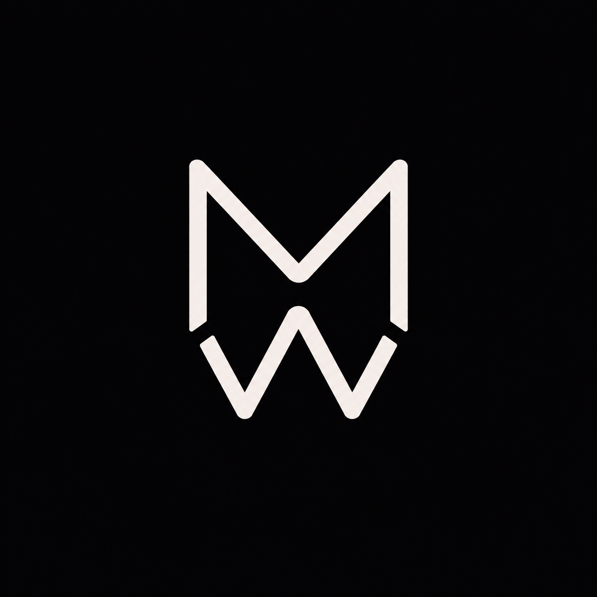

# Michal "Mewy" Urbánek

### Senior Mobile Developer

Building mobile experiences since **2012**

**Flutter • Android • Go**

---

## 👋 About

I'm a mobile developer with **13+ years of experience** building production applications for startups, scale-ups, and enterprise clients.

I started as a **native Android developer** and have been focused mainly on **Flutter** for the past **5 years**. I also have backend experience with **Go**.

I enjoy clean architecture, scalable codebases, developer experience, and building products people love to use.

---

## 🛠 Tech Stack

---

## 🌍 Selected Work

<table>
  <tr>
    <td width="96" align="center" valign="middle">
      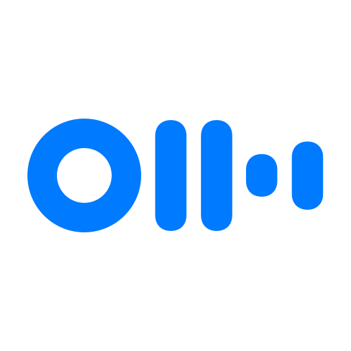
    </td>
    <td valign="top">
      <strong><a href="https://play.google.com/store/apps/details?id=com.aisense.otter">Otter.ai</a></strong> 
      <strong>Sole Android Developer</strong> 
      AI-powered transcription app with offline recording, collaboration features, reactions, comments, and analytics-heavy flows.
    </td>
  </tr>
  <tr>
    <td width="96" align="center" valign="middle">
      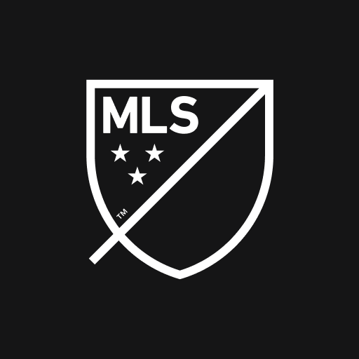
    </td>
    <td valign="top">
      <strong><a href="https://play.google.com/store/apps/details?id=com.mlssoccer">MLS</a></strong> 
      <strong>Android Developer</strong> 
      Official Major League Soccer mobile application focused on performance, reliability, and fan-facing experiences.
    </td>
  </tr>
  <tr>
    <td width="96" align="center" valign="middle">
      
    </td>
    <td valign="top">
      <strong><a href="https://www.legalzoom.com/">LegalZoom</a></strong> 
      <strong>Android Developer</strong> 
      Mobile legal services app with LLC features, Box SDK integration, online document signing, and heavy automated testing.
    </td>
  </tr>
  <tr>
    <td width="96" align="center" valign="middle">
      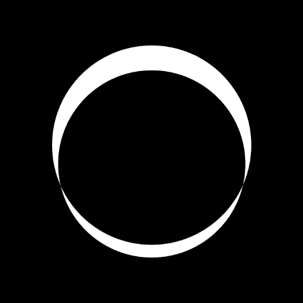
    </td>
    <td valign="top">
      <strong><a href="https://play.google.com/store/apps/details?id=com.elemind">Elemind</a></strong> 
      <strong>Android Developer</strong> 
      Sleep technology app involving Bluetooth connectivity, wearable communication, analytics, and data-focused experiences.
    </td>
  </tr>
  <tr>
    <td width="96" align="center" valign="middle">
      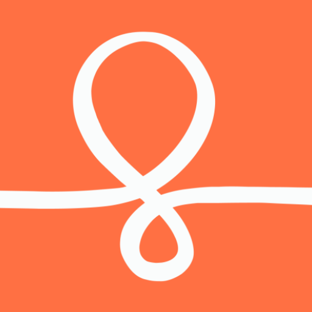
    </td>
    <td valign="top">
      <strong><a href="https://play.google.com/store/apps/details?id=com.couchsurfing.mobile.android">Couchsurfing</a></strong> 
      <strong>Flutter Developer</strong> 
      Contributed to the rewrite of a globally known travel community app from native Android to Flutter.
    </td>
  </tr>
  <tr>
    <td width="96" align="center" valign="middle">
      
    </td>
    <td valign="top">
      <strong><a href="https://play.google.com/store/apps/details?id=com.ascension.app">Ascension</a></strong> 
      <strong>Backend Developer — Go</strong> 
      Worked on backend services powering a large-scale mobile content platform.
    </td>
  </tr>
  <tr>
    <td width="96" align="center" valign="middle">
      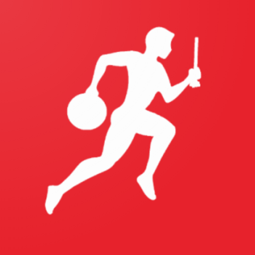
    </td>
    <td valign="top">
      <strong><a href="https://play.google.com/store/apps/details?id=com.mewy.firesport">FireSport</a></strong> 
      <strong>Founder & Flutter Developer</strong> 
      Designed, built, and maintain my own Flutter app for the Czech firefighting sports community.
    </td>
  </tr>
  <tr>
    <td width="96" align="center" valign="middle">
      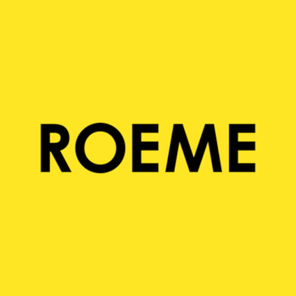
    </td>
    <td valign="top">
      <strong><a href="https://www.getroeme.com/">Roeme</a></strong> 
      <strong>Flutter Developer</strong> 
      Cross-platform creator marketing platform connecting businesses and creators.
    </td>
  </tr>
  <tr>
    <td width="96" align="center" valign="middle">
      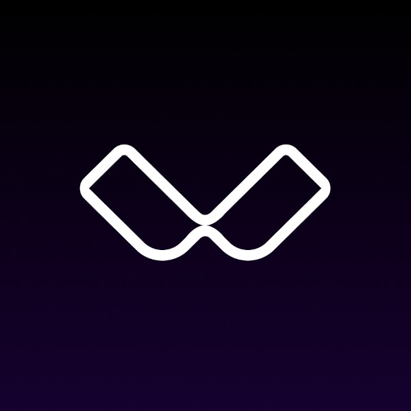
    </td>
    <td valign="top">
      <strong><a href="https://www.weartechclub.com/">WearTechClub</a></strong> 
      <strong>Flutter Developer</strong> 
      Wearable technology platform focused on Bluetooth communication, sensor data, and performance analytics.
    </td>
  </tr>
  <tr>
    <td width="96" align="center" valign="middle">
      
    </td>
    <td valign="top">
      <strong><a href="https://play.google.com/store/apps/details?id=org.faapp">The FA App</a></strong> 
      <strong>Android Developer</strong> 
      Designed, architected, and built the Android application from scratch.
    </td>
  </tr>
  <tr>
    <td width="96" align="center" valign="middle">
      
    </td>
    <td valign="top">
      <strong><a href="https://apps.apple.com/us/app/mojo-fantasy/id6450685543">Mojo Fantasy</a></strong> 
      <strong>Android Developer</strong> 
      Real-time fantasy sports product with fast-moving requirements and performance-focused mobile experiences.
    </td>
  </tr>
  <tr>
    <td width="96" align="center" valign="middle">
      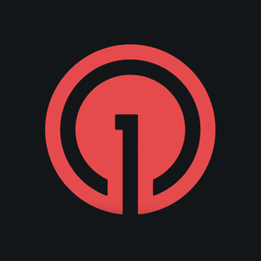
    </td>
    <td valign="top">
      <strong><a href="https://play.google.com/store/apps/details?id=com.onesignal.parking">OneSignal Parking</a></strong> 
      <strong>Flutter Developer</strong> 
      Showcase Flutter application demonstrating OneSignal integrations and mobile engagement workflows.
    </td>
  </tr>
  <tr>
    <td width="96" align="center" valign="middle">
      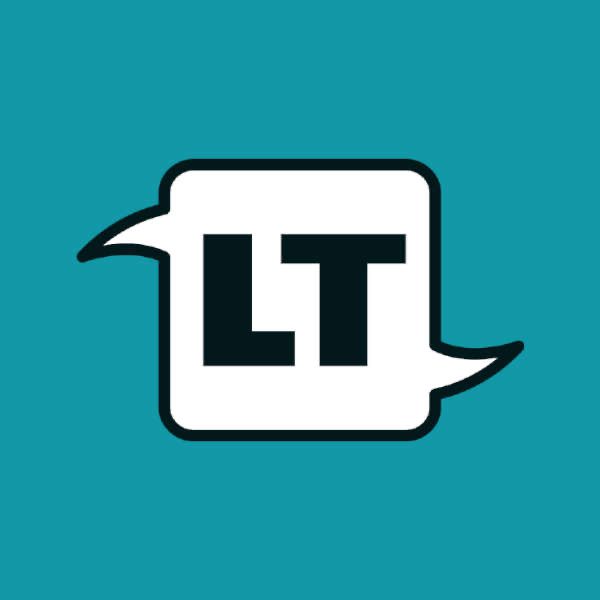
    </td>
    <td valign="top">
      <strong><a href="https://languagetogether.com/">Language Together</a></strong> 
      <strong>Flutter Developer</strong> 
      Brief contribution to a cross-platform language learning application.
    </td>
  </tr>
  <tr>
    <td width="96" align="center" valign="middle">
      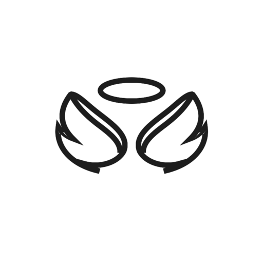
    </td>
    <td valign="top">
      <strong>Ask the Angel</strong> 
      <strong>Flutter Developer</strong> 
      Confidential Flutter application focused on polished user experience and scalable architecture.
    </td>
  </tr>
</table>

---

## ⭐ Open Source

### [STRV Flutter Template](https://github.com/strvcom/flutter-template)

One of the founding contributors behind STRV's Flutter Template, helping define reusable architecture, development standards, tooling, and best practices for Flutter projects.

---

## 🚀 Currently Interested In

- Flutter
- Clean Architecture
- AI-powered mobile apps
- Developer Experience
- Open Source
- FireSport

---

## 🤝 Connect

[GitHub](https://github.com/michalurbanek) · [LinkedIn](https://www.linkedin.com/in/michal-urbanek/) · [Facebook](https://www.facebook.com/Mewyk/) · [Email](mailto:michal.urbanekk@gmail.com)

---

*Great mobile apps aren't just built — they're carefully crafted.*

